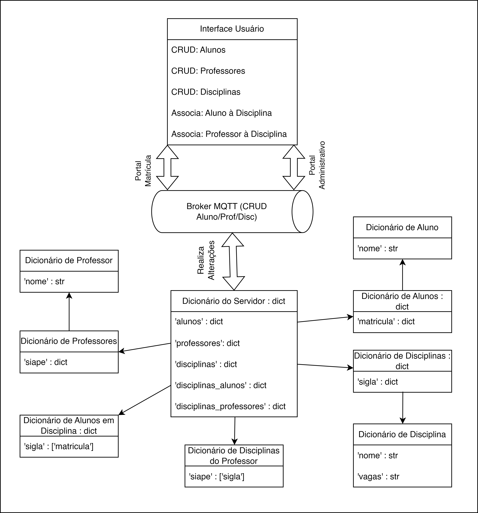

# Projeto --- Parte 1

Para compilar o projeto, execute:

```bash
chmod +x compile.sh && ./compile.sh;
```

Para inicializar o projeto, deve-se executar pelo menos um servidor por:
-   Arquivo  ``./admin-server.sh``  para executar o servidor do Portal Administrativo, recebendo como parâmetro ao menos a porta em que o servidor deve aguardar conexões.
-   Arquivo  ``./admin-client.sh``  para executar o cliente do Portal Administrativo, recebendo como parâmetro ao menos a porta do servidor que deve se conectar.
-   Arquivo  ``./mat-server.sh``  para executar o servidor do Portal de Matrícula, recebendo como parâmetro ao menos a porta em que o servidor deve aguardar conexões.
-   Arquivo  ``./mat-client.sh``  para executar o cliente do Portal de Matrícula, recebendo como parâmetro ao menos a porta do servidor que deve se conectar.

## Estrutura do Projeto

### Protótipos gRPC

- `protos/portal_administrativo.proto`: gera os protótipos do gRPC das mensagens e serviços do Portal Administrativo;
- `protos/portal_administrativo.proto`: gera os protótipos do gRPC das mensagens e serviços do Portal de Matrícula.

### Scripts dos Portais

- `scripts/portal_administrativo:`scripts referentes ao Portal Administrativo;
    - `scripts/portal_administrativo/client.py`: criação de um objeto `Cliente` que conecta-se ao Portal Administrativo (possui todas as operações de CRUD para professor, aluno e disciplina --- possui também operação RA, i.e., remover todas, entidades);
    - `scripts/portal_administrativo/server.py`: criação de um servidor que se conectará ao broker MQTT e escutará mensagens referentes às mensagens do Portal Administrativo;
    - `scripts/portal_administrativo/protos/`: protótipos criados pelo gRPC automaticamente;
    - `scripts/portal_administrativo/utils/`: implementação de ações e serviços do Portal Administrativo, tais como input do usuário, um CRUD para qualquer tipo de entidade (aluno, professor ou matrícula) e o servicer do servidor (ficou implementado a classe do gRPC do Portal Administrativo em `scripts/portal_administrativo/utils/server_service.py.ServerService.PortalAdministrativo`).
    
- `scripts/portal_matricula`: cripts referentes ao Portal de Matrícula.
    - `scripts/portal_matricula/client.py`: criação de um objeto `Cliente` que conecta-se ao Portal de Matrícula (possui todas as operações de CRUD para professor, aluno e disciplina --- possui também operação RA, i.e., remover todas, entidades);
    - `scripts/portal_matricula/server.py`: criação de um servidor que se conectará ao broker MQTT e escutará mensagens referentes às mensagens do Portal de Matrícula.
    - `scripts/portal_matricula/protos/`: protótipos criados pelo gRPC automaticamente;
    - `scripts/portal_matricula/utils/`: implementação de ações e serviços do Portal de Matrícula, tais como input do usuário, uma interface para qualquer ação (adicionar professor ou aluno à disciplina, detalhar disciplina e obter disciplinas de professor ou de aluno) e o servicer do servidor (ficou implementado a classe do gRPC do Portal Administrativo em `scripts/portal_matricula/utils/server_service.py.ServerService.PortalMatricula`).

### Estrutura de Dados

Nosso servidor possui a seguinte estrutura de dados e interface com o usuário:

